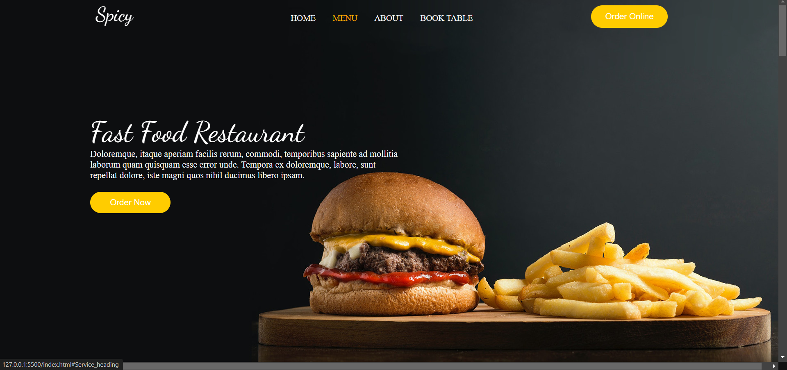
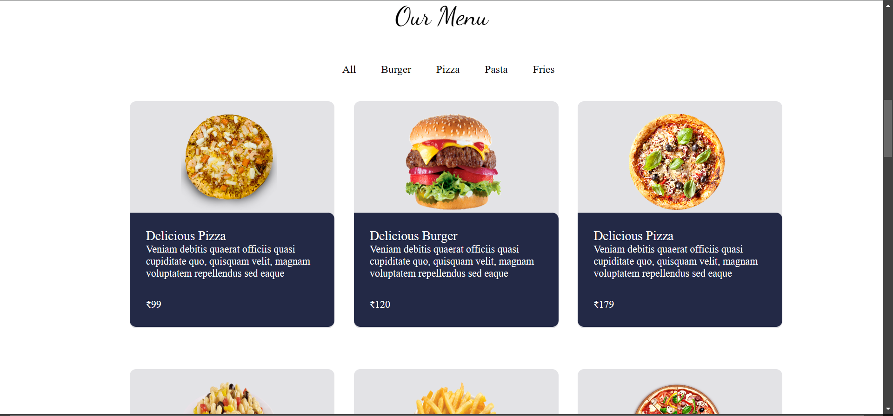
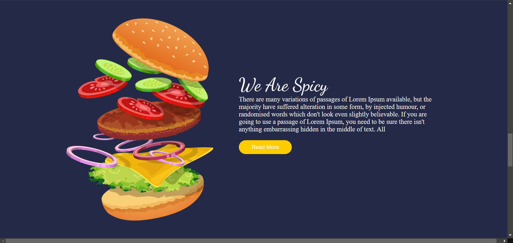
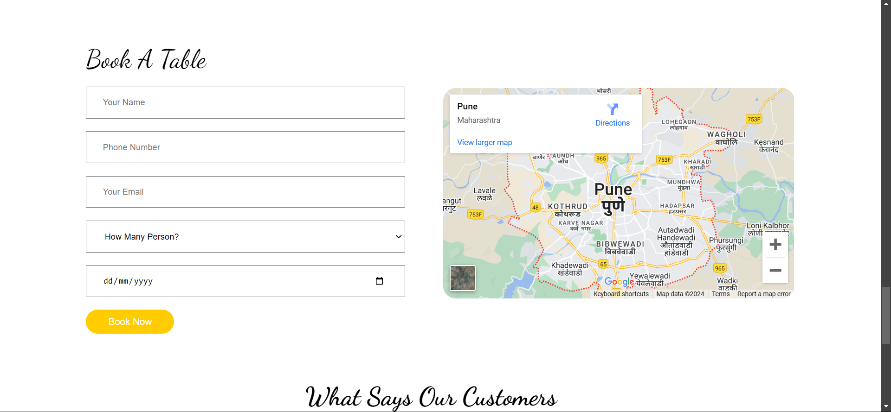
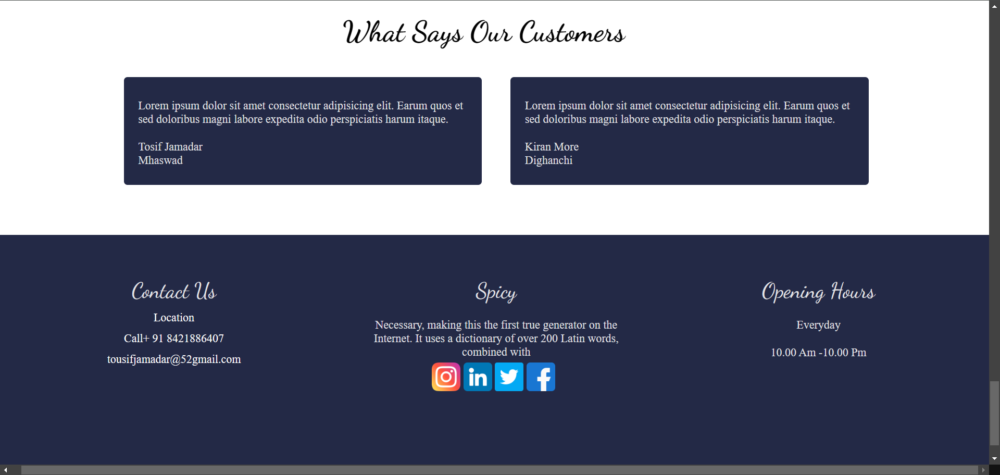

# Spicy
A restaurant is a business formation which prepares and serves food to customers in return for money, either paid before the meal, after the meal, or with a running tab. Meals are generally served and eaten on premises.
# MENUS
* Burger
* Pizza
* Fries
* PAsta
# IMAGES
### Home Page

### Menu Page

### About Page

### Book A Table Page

### Review& Footer Page

 
 ### vist our website 🤗🤗
 [Click Here](https://thespicyfood.netlify.app/)